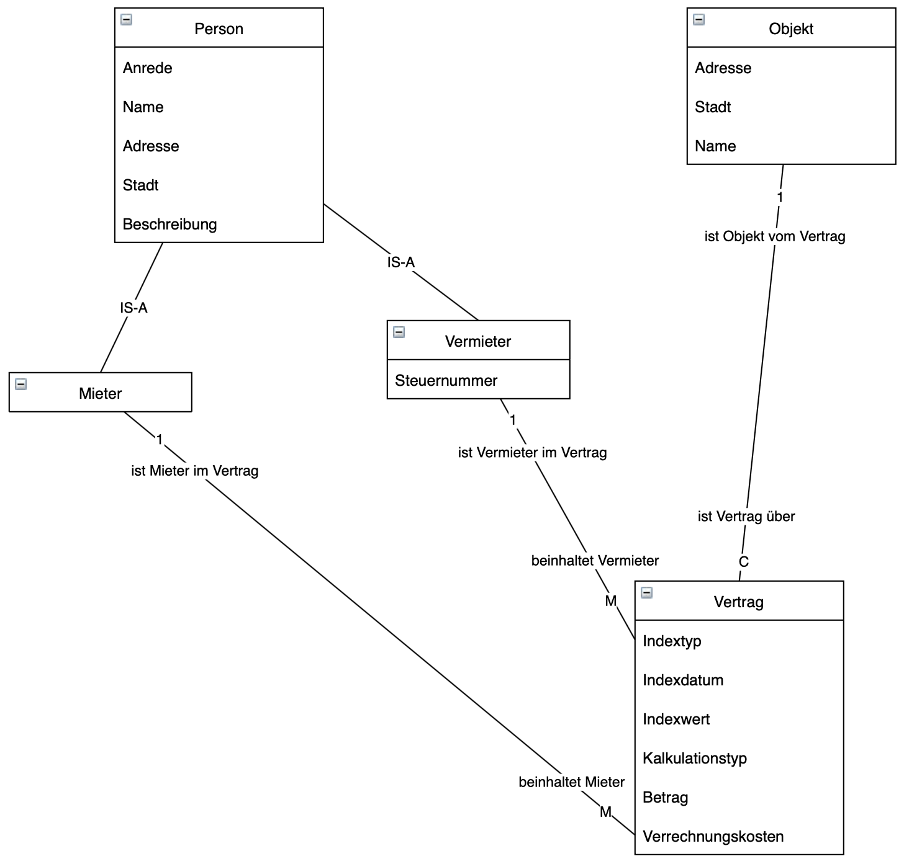
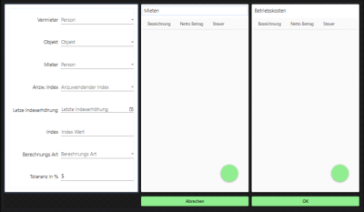

# Anforderungspezifikation: CHARGE
# 1 Ist-Zustand
## 1.1 As-Is Prozesse des Kunden
Aktuell muss der Vermieter den Verbraucher-Preis-Index manuell kontrollieren, und gegebenfalls den Mietpreis manuell erhöhen.

## 1.2 Bedürfnisse des Kunden
Automatisierte Preiswarnungen und Mietpreiserhöhung basierend auf Verbraucher-Preis-Index, Mietverträgen und Stammdaten.

# 2 Soll-Zustand
## 2.1 Zielerreichungs-Strategie
Die Projektprodukt soll als Web-App umgesetzt werden.

## 2.2 Soll-Prozesse der Kunden
### 2.2.A Vermieter legt neues Mietobjekt an

## 2.3 Soll-Fachdatenmodell
Das Soll-Fachdatenmodell umfasst Vermieter, Mieter, Mietobjekte, Verträge sowie den VPI.
  
Anhang: Fachdatenmodell_v1.pdf

## 2.4 Soll-UI-Prototypen

## 2.5 Soll-Rollen
Die Soll-Rollen, die an der Applikation beteiligt sind Mieter und Vermieter.

## 2.6 Nutzer
Benutzt wird die Applikation von Vermietern, vor allem jene, welche im Besitz mehrerer Miet-Immobilien sind.

# 3 Umfeld/Rahmenbedingungen
## 3.1 Rechtlicher Rahmen
Der rechtliche Rahmen für das Projekt umfasst das DSGVO.

## 3.2 IT-Architektonische Einbindung
Die IT-Architektonische Einbindung soll On-Premise erfolgen.

## 3.3 Technische Vorgaben/Rahmenbedingungen
Die Umsetzung soll in Form einer Web-Applikation erfolgen. Diese muss den Export nach Word (.docx) und/oder PDF erlauben.
Die API am Backend soll in C# ASP.NET Core umgesetzt werden.
Das Frontend, welches auf das Backend zugreift, muss in Angular oder VUE implementiert werden.

## 3.4 Nicht-funktionale Anforderungen
Zu den NF-Anforderungen zählt die Dokumentation des Programmes. Außerdem ist es wichtig, dass die Website schnell ladet und zeitnah auf Benutzereingaben reagiert.

## 3.5 Nicht-Funktionen
Die Web-App muss nicht offline funktionieren und keine Progressive Web App sein. Außerdem wird keine geringe CPU-Auslastung und gute Übersicht ist auch nicht zwingend notwendig.

# 4 Anhang

## 4.1 AsIsStories.docx