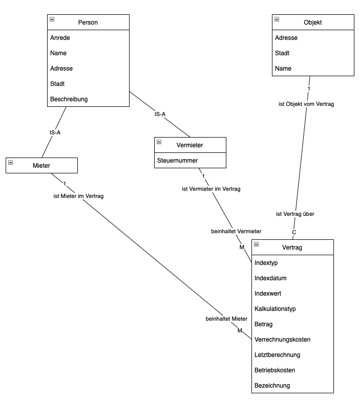
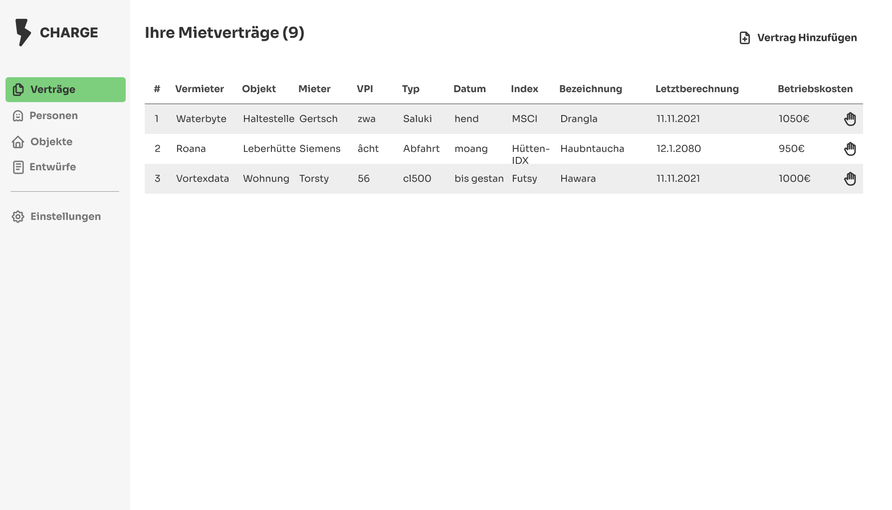
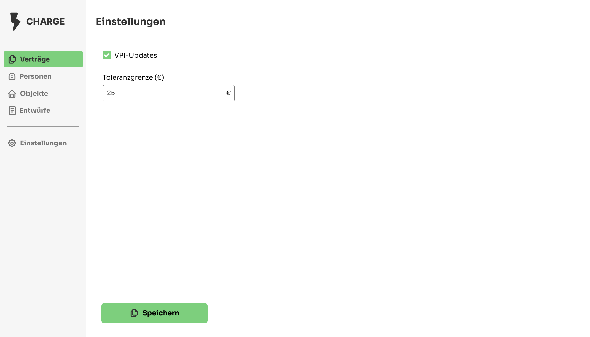
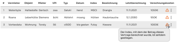
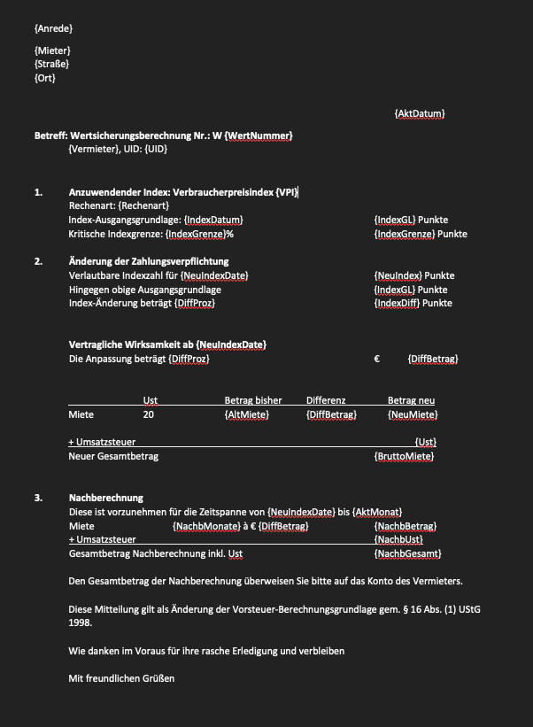

# Anforderungspezifikation: CHARGE
# 1 Ist-Zustand
## 1.1 As-Is Prozesse des Kunden
Aktuell muss der Vermieter den Verbraucher-Preis-Index manuell kontrollieren, und gegebenfalls den Mietpreis manuell erhöhen.

## 1.2 Bedürfnisse des Kunden
Automatisierte Preiswarnungen und Mietpreiserhöhung basierend auf Verbraucher-Preis-Index, Mietverträgen und Stammdaten.

# 2 Soll-Zustand
## 2.1 Zielerreichungs-Strategie
Die Projektprodukt soll als Web-App umgesetzt werden.

## 2.2 Soll-Prozesse der Kunden
Siehe Dokument <u>Soll-Prozesse_v1.2.pdf</u>

## 2.3 Soll-Fachdatenmodell
Das Soll-Fachdatenmodell umfasst Vermieter, Mieter, Mietobjekte, Verträge sowie den VPI.  
Die Attribute der Entities werden **NICHT** druch CHECKs überprüft.  
Alle Attribute (Außnahme: Steuernummer vom Vermieter) sind verpflichtend.

  
Anhang: Fachdatenmodell_v1.pdf

## 2.4 Soll-UI-Prototypen
Die Mockups weisen ausreichend Usability auf, nachdem sie mit den Kunden selbst besprochen wurden.
### 2.4.1 (Vertrags)übersicht

Mietverträge, Vermieter/Mieter und Objekte werden in einer übersichtlichen Tabelle dargestellt.  
Mithilfe der Interakionsschaltfläche am Ende jeder Tabellenzeile kann man zum Beispiel bei Verträgen Funktionen wie "Vertrag überarbeiten", "Vertrag drucken", ... verwenden.  
Der User hat die möglichkeit zwischen den Verträgen, Personen, Objekten und Entwürfen zu wechseln.  
In den Einstellungen können die Grenzen ab welchen die Ausgabe einer Warnung erfolgen soll, festgelegt werden.

Das Hinzufügen von Mietobjekten, Personen und Objekten erfolgt über "Pop-Ups".  
Mithilfe von Input-Feldern werden die wichtigen Details des anzulegenden Entities angegeben.  
Dann wird das neue Objekt durch einen Click auf den Button persistiert.
Keine der Daten werden bei der Eingabe überprüft.

Im Settings-screen kann eingestellt werden ob der VPI automatisch upgedated werden soll und ab welcher Preisdifferenz eine Warnung angezeigt werden sollte.

### 2.4.2 Warnungssystem

In der Vertragsübersicht poppt ein Warnungssymbol neben dem Vertrag auf, wenn der Index seit der Letztberechnung gestiegen ist.  
(Der Index muss so weit steigen, dass die in den Einstellungen angegeben Toleranz überschritten wird.)

### 2.4.3 PDF-export

## 2.5 Soll-Rollen
Die einzige Soll-Rolle, die an der Applikation beteiligt ist, ist ein Steuerberater. Dieser bietet die Dienstleistung für Vermieter an, bei der die Verträge (mit zugehörigen Mieter, Vermieter, Objekt) in der Applikation erfasst werden, bei einem Anstieg des VPI wird der Vertrag erneuert.

## 2.6 Nutzer
Benutzt wird die Applikation von Vermietern, vor allem jene, welche im Besitz mehrerer Miet-Immobilien sind.

## 2.7 Berechnung des Preises
--

## 2.8 Löschfunktion
Die Löschfunktion um die Daten löschen zu können wenn die Dauer des Vertrags endet, muss manuell ausgeführt werden.
Die entsprechende Schaltfläche ist unter der Interaktionschaltfläche am Ende jeder Tabellenzeile zu finden.

# 3 Umfeld/Rahmenbedingungen
## 3.1 Rechtlicher Rahmen
Der rechtliche Rahmen für das Projekt umfasst das DSG und die DSGVO.

### 3.1.1 Auswirkungen auf das Projekt
Personenbezogene Daten (Eigenschaften von Mietern, Vermietern, ... wie zum Beispiel Name, Adresse, Steuernummer, ...) sind rechtmäßig zu verarbeiten.  
Im Falle der Applikation ist die Datenverarbeitung rechtmäßig aufgrund einer rechtlichen Verpflichtung (steuerrechtliche Pflichten) des Datenverarbeiters (Steuerberater).  
Wenn ein Klient des Steuerberaters die Dienstleistung der Vertragserfassung erwirbt, muss der Steuerberater diese Dienstleistung erfüllen. Damit liegt ein berechtigtes Interesse im Sinne der steuerrechtlichen Pflichten vor.  
Es muss auf die Speicherdauer der Daten hingewiesen werden: die Daten werden bis zum Ablauf der Vertragsdauer gespeichert.
Datenauskunftsfunktion siehe Punkt 3.5.2.
Löschfunktion siehe Punkt 2.8

## 3.2 IT-Architektonische Einbindung
Das Projekt ist im 3-Schichten-Modell umzusetzen: Datenbank, Server (ASP.NET C#) und Client (Web - VUE).  
Die IT-Architektonische Einbindung soll On-Premise erfolgen.

## 3.3 Technische Vorgaben/Rahmenbedingungen
* Die Umsetzung soll in Form einer Web-Applikation erfolgen.  
* Diese muss den Export nach Word (.docx) und/oder PDF erlauben.  
* Die API am Backend soll in C# ASP.NET Core umgesetzt werden.  
* Das Frontend, welches auf das Backend zugreift, muss in Angular oder VUE implementiert werden.

### 3.3.1 Schnittstellen
#### 3.3.1.1 Verwendete Schnittstellen
Die benötigten Indexwerte für die Berechnung der Neupreise werden von [data.gv](https://www.data.gv.at/katalog/dataset/9016a823-ef08-314d-8ef5-aa12c1800f76) entnommen. 

#### 3.3.1.2 eigene Schnittstellen
Die Anwendung selbst stellt keine Form von Programmierschnittstelle zur Verfügung. 

## 3.4 Nicht-funktionale Anforderungen
* Funktionalität
    * Die Funkionen sind im Kapitel 2 ersichtlich
* Verwendbarkeit/Wartbarkeit
    * Dokumentation des Programmes in Form von Projekantrag, Projektspezifikation, Solution-Design und Tests.
* Efficiency
    * Die Website muss schnell laden (ohne Cache: <5s, mit Cache <1.5s) und zeitnah auf Benutzereingaben reagiert (<50ms bei Click Events).
* Usability
    * Wenn ein Prozess, der durch einen Click iniziiert wurde, nicht innerhalb von 50ms abgeschlossen werden kann, ist ein Progress-Indicator anzuzeigen.
    * Mockups aus Katpitel 2 wurden im Rahmen der Spezifikation mit dem Kunden gesprochen

## 3.5 Nicht-Funktionen
### 3.5.1 Allgemein
Die Web-App muss nicht offline funktionieren und keine Progressive Web App sein. Außerdem wird keine geringe CPU-Auslastung benötigt und gute Übersicht ist auch nicht zwingend notwendig. 
 
### 3.5.2 Datenauskunftfunktion
Laut Aufftraggeber wird keine explozite Funktion benötigt, mit der der Kunde Auskunft über seine gespeicherten Daten erhält.

# 3.6 Qualitätssicherung
Die Qualitätssicherung erfolgt durch den Auftraggeber beim Abnahmetest.  
Darüberhinaus wird die Qualität durch Unit-Tests, die im späteren Projektverlauf entworfen werden, gesichert.

## 3.7 Abnahmekriterien
Bei der Abnahme wird ein Vertreter der Auftraggeberorganisation die Applikation persönlich testen und folgende Schritte ausprobieren:
1. Neuen Vertrag anlegen:
    - Gegeben ist die Applikation auf der Startseite ("/"), in der Datenbank gibt es ein Objekt, einen Mieter und einen Vermieter.
    - Wenn der Benutzer die Vertragsdetails ausfüllt, das Objekt, den Mieter und den Vermieter auswählt und auf "Vertrag anlegen" drückt wird der Vertrag gespeichert.
2. Neuen Mieter anlegen
    - Gegeben ist die Applikation auf der Route "/mieter"
    - Wenn der Benutzer die Schaltfläche "neuen Mieter anlegen" drückt, die Mietereigenschaften angibt und auf "Mieter anlegen" drückt wird der Mieter gespeichert.
3. Neuen Vermieter anlegen
    - Gegeben die Applikation auf der Route "/vermieter"
    - Wenn der Benutzer die Schaltfläche "neuen Vermieter anlegen" drückt, die Vermietereigenschaften angibt und auf "Vermieter anlegen" drückt wird der Vermieter gespeichert.
4. Neues Objekt anlegen
    - Gegeben ist die Applikation auf der Route "/objekte"
    - Wenn der Benutzer auf die Schaltfläche "neues Objekt anlegen" drückt, die Objekteigenschaften angibt und auf "Objekt anlegen" drückt wird das Objekt gespeichert
5. Vertrag exportieren 
    - Gegeben ist eine Datenbank mit einem vollständig erfassten Vertrag
    - Wenn der Benutzer die Schaltfläche "Exportieren" im Interaktionsmenü auslöst, wird der Vertrag im pdf-Format mithilfe der Vorlage auf Bild 2.4.3 exportiert.
6. Warnungssystem:
    - Gegeben ist die Applikation auf der Startseite ("/") eine Datenbank mit einem vollständig erfassten Vertrag
    - Wenn der im Vertrag erfasste Indexwert stärker als die in den Einstellungen angegebene Toleranz abweicht wird in der Vertragsliste die Warnung angezeigt.  
    
7. Preisaktualisierung
    - Gegeben ist die Applikation auf der Startseite ("/") eine Datenbank mit einem vollständig erfassten Vertrag
    - Wenn der Benutzer auf die Interaktionsschaltfläche und danach auf "Vertrag aktualisieren" klickt, wird der Vertrag mit dem aktuellen Wert von data.gv neu berechnet.
    
# 4 Anhang
## 4.1 AsIsStories.docx
<u>AsIsStories.docx</u>